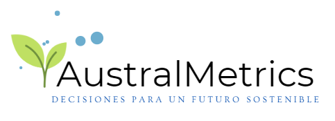

# Data Science Solutions Web Project for Agriculture and Aquaculture

Welcome to the repository containing the codebase for a dynamic web page designed to showcase data science consulting services tailored to agriculture and aquaculture. This website includes sections for services, portfolio, use cases, and a contact form—everything a forward-thinking consulting service needs to engage clients and convey impact.

<p align="center">
  
</p>

## Project Structure

- `index.html`: The main HTML page for structuring content and navigation.
- `css/styles.css`: Defines the site's visual styling and layout.
- `js/scripts.js`: JavaScript logic for interactive features.
- `images/`: Folder containing site assets like logos, icons, and portfolio images.
- `sitemap.xml` and `robots.txt`: Files to optimize SEO and manage search engine behavior.
- `formulario.php`: Backend script for processing the contact form submissions.

## Key Technologies

- **HTML5 and CSS3**: For building the page's structure and styling.
- **JavaScript**: Adding interactive elements and dynamic user experience.
- **PHP**: Handling backend form submissions.
- **SEO Optimization**: Implemented with `sitemap.xml` and `robots.txt` to improve search engine visibility.

## Project Setup

To run this project locally, follow these steps:

1. Clone the repository:
    ```bash
    git clone https://github.com/username/DataScienceWebConsulting.git
    cd DataScienceWebConsulting
    ```

2. Run a Local Server: Since this project uses PHP for form handling, it’s best to use a local server. You can set up with tools like XAMPP or WAMP for local testing.

## Contribution Guidelines

To contribute to this project:

1. Fork the repository.
2. Create a new branch:
    ```bash
    git checkout -b feature/your-feature
    ```
3. Make your changes and commit:
    ```bash
    git commit -am 'Add a new feature'
    ```
4. Push to your branch:
    ```bash
    git push origin feature/your-feature
    ```
5. Create a pull request.

## License

This project is licensed under the [Creative Commons Attribution-NonCommercial 4.0 International](https://creativecommons.org/licenses/by-nc/4.0/). This license allows for sharing and adapting the project non-commercially, as long as credit is given to the original creator.
